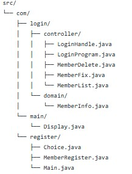

# 로그인 및 회원 관리 프로그램

## 개요
이 프로젝트는 사용자 회원가입 및 로그인 기능을 제공하는 프로그램입니다. Java를 사용하여 구현되었으며, 사용자 친화적인 메뉴 기반 인터페이스를 제공합니다. 사용자는 회원가입을 통해 계정을 만들고, 로그인하여 프로그램의 기능을 이용할 수 있습니다.

## 기능
- **로그인 처리**: 사용자 인증 및 세션 관리
- **회원 관리**: 회원 추가, 수정, 삭제 및 목록 조회
- **회원 등록**: 신규 회원 등록 및 등록 선택 기능
- **UI 표시**: 사용자 인터페이스를 위한 화면 표시

1. 회원가입
2. 로그인
3. 회원 정보 확인
4. 회원 정보 수정
5. 회원 탈퇴
6. 프로그램 종료

## 파일 구조



## 소스 디렉토리 (src/)
- **com/**: 기본 패키지
  - **login/**: 로그인 관련 기능
    - **controller/**: 로그인 처리 및 관련 로직
      - `LoginHandle.java`: 로그인 요청 처리
      - `LoginProgram.java`: 로그인 프로그램 실행 로직
      - `MemberDelete.java`: 회원 삭제 기능
      - `MemberFix.java`: 회원 정보 수정 기능
      - `MemberList.java`: 회원 목록 조회 기능
    - **domain/**: 도메인 모델
      - `MemberInfo.java`: 회원 정보 모델 클래스
    - **main/**: 프로그램의 진입점
      - `Display.java`: 사용자 인터페이스 표시
    - **register/**: 회원 등록 관련 기능
      - `Choice.java`: 등록 방법 선택 기능
      - `MemberRegister.java`: 회원 등록 로직
      - `Main.java`: 등록 프로그램의 진입점


## 클래스 설명

### 1. Display.java
프로그램의 진입점으로, 회원 등록을 관리하는 `MemberRegister` 객체를 생성하고 로그인 화면을 표시합니다.

### 2. Choice.java
메인 메뉴를 제공하는 클래스입니다. 사용자 입력을 받아 회원가입, 로그인 및 프로그램 종료 기능을 처리합니다. 로그인 실패 시 메시지를 출력하는 기능도 포함되어 있습니다.

### 3. LoginHandle.java
로그인 처리를 담당하는 클래스입니다. 로그인 시도 횟수를 관리하고, 성공 시 사용자에 따라 관리자 메뉴 또는 일반 사용자 메뉴로 이동합니다.

### 4. LoginProgram.java
사용자로부터 아이디와 비밀번호를 입력받아 로그인 처리를 수행하는 클래스입니다. 로그인 성공 여부에 따라 적절한 메시지를 출력합니다.

### 5. MemberInfo.java
회원 정보를 저장하는 도메인 클래스입니다. 회원의 ID, 비밀번호, 이름, 전화번호, 주소 등을 포함합니다.

### 6. MemberRegister.java
회원 정보를 관리하는 클래스입니다. 회원 추가, 파일에서 데이터 로드 및 저장 기능을 제공합니다.

### 7. MemberList.java
회원 정보를 출력하는 클래스입니다. 특정 회원의 정보를 검색하여 출력하는 기능을 제공합니다.

### 8. MemberFix.java
회원 정보를 수정하는 클래스입니다. 회원의 ID를 기반으로 정보를 수정하고, 수정된 정보를 파일에 저장합니다.

### 9. MemberDelete.java
회원 정보를 삭제하는 클래스입니다. 이름과 비밀번호를 기반으로 회원을 삭제하고, 업데이트된 정보를 파일에 저장합니다.

### 10. Main.java
사용자 메뉴를 표시하는 클래스입니다. 사용자로부터 입력을 받아 회원 정보 확인, 수정, 삭제 및 프로그램 종료 기능을 제공합니다.

## 사용 방법
1. **환경 설정**: Java JDK가 설치되어 있어야 합니다.
2. **소스 코드 컴파일**: `src` 디렉토리에서 Java 파일을 컴파일합니다.
   ```bash
   javac com/login/main/Display.java
